# PrimeAssist — AI Customer Support Chatbot

An AI-powered customer support chatbot that uses a locally trained **bidirectional LSTM** (RNN) for intent classification, a **SQLite database** for real-time order/refund/account lookups, and a **Flask web server** with a dark glassmorphism UI.

---

## Table of Contents

- [System Architecture](#system-architecture)
- [Features](#features)
- [Tech Stack](#tech-stack)
- [Project Structure](#project-structure)
- [Setup & Installation](#setup--installation)
- [Usage](#usage)
- [API Endpoints](#api-endpoints)
- [Database Schema](#database-schema)
- [RNN Model](#rnn-model)
- [Training Pipeline](#training-pipeline)
- [Chat History](#chat-history)
- [Conversation Flows](#conversation-flows)
- [Sample Data](#sample-data)
- [Training Session Versioning](#training-session-versioning)
- [Lecture Techniques Applied](#lecture-techniques-applied)

---

## System Architecture


---

## Features

```mermaid
mindmap
  root((PrimeAssist))
    🧠 AI Engine
      BiLSTM Intent Classifier
      27 Customer Support Intents
      99% Accuracy
      5-Fold Cross Validation
    💬 Conversations
      Multi-turn Flows
      Follow-up Questions
      Session Management
      Context Awareness
    🗄️ Database
      Order Tracking
      Refund Status
      Account Lookup
      Password Reset
    🎨 Web UI
      Glassmorphism Design
      Ambient Glow Effects
      Typing Animations
      Responsive Mobile
    📊 Analytics
      Chat History Logging
      Intent + Confidence
      Session Versioning
      Training Diffs
```



---

## Tech Stack

| Component | Technology |
|---|---|
| ML Framework | PyTorch (bidirectional LSTM) |
| Dataset | [Bitext Customer Support LLM Chatbot Training Dataset](https://huggingface.co/datasets/bitext/Bitext-customer-support-llm-chatbot-training-dataset) |
| NLP | NLTK (stopwords, stemming) |
| Backend | Flask |
| Database | SQLite |
| Frontend | Vanilla HTML/CSS/JS |
| Styling | Custom CSS with glassmorphism, gradients, animations |
| Typography | [Inter](https://fonts.google.com/specimen/Inter) (Google Fonts) |

---

## Project Structure

```
Support_Chatbot-main/
├── server.py                  # Flask web server (API + static files)
├── train_rnn.py               # RNN training script (run once)
├── requirements.txt           # Python dependencies
│
├── app/                       # Application modules
│   ├── rnn_matcher.py         #   LSTM model loader & inference
│   ├── conversation.py        #   Multi-turn conversation engine
│   ├── main.py                #   CLI chatbot (terminal alternative)
│   ├── bot.py                 #   LLM helper (legacy, optional)
│   ├── matcher.py             #   TF-IDF FAQ matcher (legacy)
│   ├── config.py              #   Configuration constants
│   ├── data_loader.py         #   FAQ data loader
│   └── prompts.py             #   Prompt templates
│
├── model/                     # Trained model artifacts
│   ├── chatbot_rnn.pth        #   Model weights (3.9 MB)
│   ├── config.json            #   Model hyperparameters
│   ├── vocab.pkl              #   Word-to-index vocabulary
│   ├── intent2idx.json        #   Intent → label index mapping
│   ├── idx2intent.json        #   Label index → intent mapping
│   ├── intent_responses.json  #   Intent → response templates
│   ├── history.json           #   Training loss/accuracy per epoch
│   ├── training_curves.png    #   Loss & accuracy plots
│   ├── confusion_matrix.png   #   27×27 confusion matrix
│   └── runs/                  #   Training session archives
│
├── db/                        # Database
│   ├── schema.sql             #   Table definitions
│   ├── seed.py                #   Sample data seeder
│   └── primeassist.db         #   SQLite database file
│
├── static/                    # Frontend assets
│   ├── index.html             #   Chat UI page
│   ├── style.css              #   Glassmorphism styles
│   └── app.js                 #   Chat logic & interactions
│
├── chat_history/              # Saved conversations (auto-created)
│   └── <session_id>.json      #   One file per chat session
│
└── adv prg lectures/          # Course lecture notebooks
    ├── adv prg lec2.ipynb     #   NumPy & Pandas basics
    ├── adv prg lec3.ipynb     #   Data preprocessing & encoding
    ├── adv prg lec4.ipynb     #   Linear regression & decision trees
    ├── adv prg lec5.ipynb     #   Classification & Random Forest
    ├── advprj lec 6.ipynb     #   Neural networks (Keras + PyTorch)
    └── advprj lec 7.ipynb     #   CNN + RNN/LSTM
```

---

## Setup & Installation

```bash
# 1. Create virtual environment
python -m venv .venv_new
.venv_new\Scripts\activate          # Windows
# source .venv_new/bin/activate     # Linux/Mac

# 2. Install dependencies
pip install -r requirements.txt

# 3. Seed the database (creates db/primeassist.db)
python -m db.seed

# 4. Train the RNN model (creates model/ artifacts)
python train_rnn.py

# 5. Start the web server
python server.py
# Open http://localhost:5000
```

---

## Usage

### Web Interface
```bash
python server.py
# Open http://localhost:5000 in your browser
```

### CLI Interface (alternative)
```bash
python -m app.main
```

---

## API Endpoints

### `POST /api/chat`

Send a message and receive a response.

**Request:**
```json
{
  "message": "Where is my order?",
  "session_id": "optional-session-id"
}
```

**Response:**
```json
{
  "reply": "I'd be happy to help track your order! Could you please provide your order number?",
  "intent": "track_order",
  "confidence": 0.97,
  "session_id": "abc-123"
}
```

---

### `GET /api/history`

List all saved chat sessions.

**Response:**
```json
[
  {
    "session_id": "abc-123",
    "created_at": "2026-02-11T01:42:00",
    "turns": 5
  }
]
```

---

### `GET /api/history/<session_id>`

Get full conversation history for a session.

**Response:**
```json
{
  "session_id": "abc-123",
  "created_at": "2026-02-11T01:42:00",
  "updated_at": "2026-02-11T01:45:00",
  "turns": [
    {
      "timestamp": "2026-02-11T01:42:30",
      "user": "Where is my order?",
      "bot": "Could you please provide your order number?",
      "intent": "track_order",
      "confidence": 0.9712
    }
  ]
}
```

---

## Database Schema


---

## RNN Model

### Model Architecture


### Hyperparameters

| Parameter | Value |
|---|---|
| Vocab size | 2,519 |
| Embedding dim | 128 |
| Hidden dim | 128 |
| LSTM layers | 2 (bidirectional) |
| Dropout | 0.5 |
| Max sequence length | 40 |
| Batch size | 64 |
| Learning rate | 1e-3 |
| Optimizer | Adam |
| Loss function | CrossEntropyLoss |
| Parameters | 988,827 |

### Training Results

| Metric | Value |
|---|---|
| Final Accuracy | **99%** |
| 5-Fold CV Accuracy | **99.23% ± 0.07%** |
| Dataset Size | 26,872 samples |
| Intents | 27 |
| Train Split | 21,497 (80%) |
| Test Split | 5,375 (20%) |
| Precision (macro) | 0.99 |
| Recall (macro) | 0.99 |
| F1-Score (macro) | 0.99 |

### Supported Intents (27)

```mermaid
graph TD
    subgraph Order ["📦 Order Management"]
        A1[track_order]
        A2[place_order]
        A3[cancel_order]
        A4[change_order]
        A5[check_cancellation_fee]
    end

    subgraph Payment ["💳 Payment & Refunds"]
        B1[get_refund]
        B2[track_refund]
        B3[check_refund_policy]
        B4[payment_issue]
        B5[check_payment_methods]
        B6[check_invoice]
        B7[get_invoice]
    end

    subgraph Account ["👤 Account"]
        C1[create_account]
        C2[edit_account]
        C3[delete_account]
        C4[switch_account]
        C5[recover_password]
        C6[registration_problems]
    end

    subgraph Shipping ["🚚 Shipping"]
        D1[delivery_options]
        D2[delivery_period]
        D3[change_shipping_address]
        D4[set_up_shipping_address]
    end

    subgraph Support ["🎧 Support"]
        E1[contact_customer_service]
        E2[contact_human_agent]
        E3[complaint]
        E4[review]
        E5[newsletter_subscription]
    end
```



### Model Artifacts (`model/`)

| File | Size | Description |
|---|---|---|
| `chatbot_rnn.pth` | 3.9 MB | PyTorch model weights |
| `config.json` | ~500 B | Model configuration + CV results |
| `vocab.pkl` | 30 KB | Word → index vocabulary |
| `intent2idx.json` | 622 B | Intent → label mapping |
| `idx2intent.json` | 676 B | Label → intent mapping |
| `intent_responses.json` | 14 KB | Intent → response templates |
| `history.json` | 1.2 KB | Training loss/accuracy history |
| `training_curves.png` | 65 KB | Train vs val loss/accuracy |
| `confusion_matrix.png` | 43 KB | 27×27 confusion matrix |

---

## Training Pipeline


---

## Chat History

All conversations are automatically saved to the `chat_history/` folder.

- **Format**: JSON — one file per session (`<session_id>.json`)
- **Each turn includes**: timestamp, user message, bot reply, model intent, confidence score
- **API access**: `GET /api/history` (list all), `GET /api/history/<id>` (single session)

### Example File

```json
{
  "session_id": "a1b2c3d4",
  "created_at": "2026-02-11T01:42:00",
  "updated_at": "2026-02-11T01:45:00",
  "turns": [
    {
      "timestamp": "2026-02-11T01:42:30",
      "user": "I want to track my order",
      "bot": "Could you please provide your order number?",
      "intent": "track_order",
      "confidence": 0.9712
    }
  ]
}
```

---

## Conversation Flows


### Order-based Intents
These intents trigger an order number prompt → DB lookup:
- `track_order` → Shows order status, tracking number, delivery date
- `cancel_order` → Checks if cancellable, confirms
- `get_refund` → Looks up existing refund or offers to create one
- `track_refund` → Shows refund status and amount
- `check_cancellation_fee` → Shows cancellation details

### Account-based Intents
These intents trigger an email prompt → DB lookup:
- `recover_password` → Finds account, sends reset link
- `change_shipping_address` → Shows current address, allows update
- `switch_account` / `edit_account` / `delete_account` → Shows account info

### Direct Response Intents
All other intents return the RNN model's trained response immediately (no DB lookup needed):
- `check_payment_methods`, `delivery_options`, `place_order`, `complaint`, etc.

---

## Sample Data

### Test Orders

| Order ID | Customer | Product | Status | Tracking |
|---|---|---|---|---|
| ORD-1001 | Alice Johnson | Wireless Headphones | Delivered | TRK-50001 |
| ORD-1002 | Alice Johnson | Phone Case (Black) | Shipped | TRK-50002 |
| ORD-1003 | Bob Smith | Mechanical Keyboard | Processing | — |
| ORD-1004 | Bob Smith | USB-C Hub | Delivered | TRK-50004 |
| ORD-1005 | Charlie Davis | Running Shoes | Shipped | TRK-50005 |
| ORD-1006 | Charlie Davis | Yoga Mat | Cancelled | — |
| ORD-1007 | Diana Lee | Smartwatch Pro | Delivered | TRK-50007 |
| ORD-1008 | Diana Lee | Laptop Stand | Processing | — |
| ORD-1009 | Eve Martinez | Bluetooth Speaker | Shipped | TRK-50009 |
| ORD-1010 | Eve Martinez | Desk Lamp LED | Delivered | TRK-50010 |

### Test Accounts

| Email | Name |
|---|---|
| alice@example.com | Alice Johnson |
| bob@example.com | Bob Smith |
| charlie@example.com | Charlie Davis |
| diana@example.com | Diana Lee |
| eve@example.com | Eve Martinez |

### Test Refunds

| Refund ID | Order | Amount | Status |
|---|---|---|---|
| REF-2001 | ORD-1001 | $59.99 | Completed |
| REF-2002 | ORD-1006 | $29.99 | Completed |
| REF-2003 | ORD-1004 | $34.99 | Processing |
| REF-2004 | ORD-1007 | $199.99 | Pending |

---

## Training Session Versioning

Every time you run `python train_rnn.py`, the session is automatically archived:

```
model/runs/
├── sessions_log.json          # All runs with metrics + config for comparison
├── 20260211_020100/           # Timestamped snapshot
│   ├── chatbot_rnn.pth        #   Model weights
│   ├── config.json            #   Full hyperparameters + dataset info
│   ├── history.json           #   Per-epoch loss/accuracy
│   ├── training_curves.png    #   Loss & accuracy plots
│   ├── confusion_matrix.png   #   27×27 confusion matrix
│   ├── classification_report.txt  # Per-intent precision/recall/F1
│   ├── vocab.pkl, intent2idx.json, idx2intent.json, intent_responses.json
│   └── ...
├── 20260211_030200/           # Next run
│   └── ...
```

### Session Comparison

After each training run, a diff table is printed comparing with the previous run:

```
[*] Comparison with previous training session:
    Metric                  Previous      Current       Diff
    ------------------------------------------------------
    Val Accuracy              0.9900       0.9920     +0.0020
    Val Loss                  0.0450       0.0380     -0.0070
    Train Accuracy            0.9980       0.9990     +0.0010
    Epochs Run               30.0000      22.0000     -8.0000

    Config changes:
      max_epochs: 30 -> 100
```

### Sessions Log (`sessions_log.json`)

```json
[
  {
    "run_id": "20260211_020100",
    "timestamp": "2026-02-11T02:01:00",
    "epochs_run": 30,
    "max_epochs": 30,
    "early_stopped": false,
    "final_train_acc": 0.998,
    "final_val_acc": 0.990,
    "final_train_loss": 0.008,
    "final_val_loss": 0.045,
    "best_val_loss": 0.043,
    "best_val_acc": 0.992,
    "config": { "embed_dim": 128, "hidden_dim": 128, "dropout": 0.5, "..." : "..." }
  }
]
```

---

## Lecture Techniques Applied


| Technique | Source Lecture | Code Reference |
|---|---|---|
| Missing data checks | Lec 3 | `df.isnull().sum()` |
| Class distribution analysis | Lec 5 | `value_counts()` |
| 80/20 train/test split | Lec 4 | `TEST_SPLIT = 0.20` |
| Text preprocessing | Lec 7 cell 14 | Stopwords, stemming, lowercasing |
| Tokenization + padding | Lec 7 cells 18-19 | Word→index vocab + fixed-length |
| Embedding → LSTM → Dense | Lec 7 cells 20, 23 | Bidirectional 2-layer LSTM |
| Dropout regularization | Lec 6 cell 21 | `Dropout(0.5)` |
| Early stopping | Lec 6 cell 10 | `patience=5, restore_best_weights` |
| LR scheduler | Lec 6 | `ReduceLROnPlateau` |
| Train/val loss plotting | Lec 6 cell 9 | `training_curves.png` |
| Classification report | Lec 4 | Precision, recall, F1 per intent |
| Confusion matrix | Lec 5 | `confusion_matrix.png` |
| Adam optimizer | Lec 7 cell 21 | `lr=1e-3` |
| model.train() / eval() | Lec 6 cells 16-17 | Train/eval mode switching |
| K-fold cross-validation | Lec 5 | 5-fold CV before main training |

---

## License

This project was built for educational purposes as part of the Advanced Programming course.